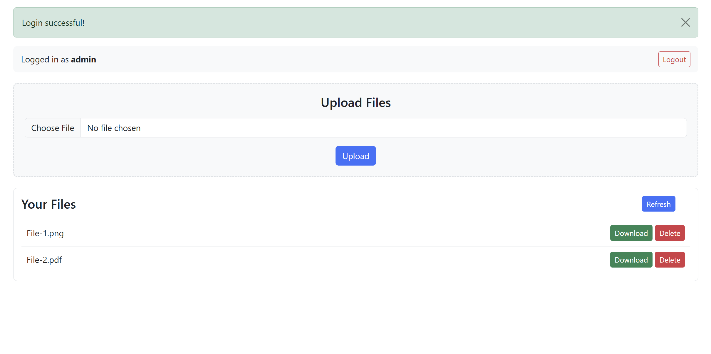

# Advanced File Sharing System
A multi-user file-sharing app (client–server) built for a networks course at LAU, with a threaded TCP backend, a MySQL metadata store, and a Flask web UI.

## High-level architecture
- **Server.py** — Multi-threaded TCP socket server; authenticates users and handles file operations using a custom **length-prefixed messaging** protocol.
- **db_handler.py** — MySQL abstraction layer storing users (including admin flag) and file metadata (path + checksum).
- **Client.py** — Reusable client logic for commands + file transfer (shared by different frontends).
- **UI.py** — Flask web interface that uses `Client.py` under the hood and manages sessions + temporary upload/download files.
- **Logger.py / ClientLogger.py** — Server/client logging to `Log.txt` and `ClientLog.txt`.

## Features
- User login + **role-based access control** (admins can delete files + view server logs).
- Upload, download, and list available files (size + modified timestamp).
- Per-user server storage directories.
- **Integrity checks** using MD5 checksums on upload/download (because bit-flips are not a vibe).

## Running
Setup/run instructions are in `ReadMe.txt` (you’ll need Python, Flask, and a MySQL database).
