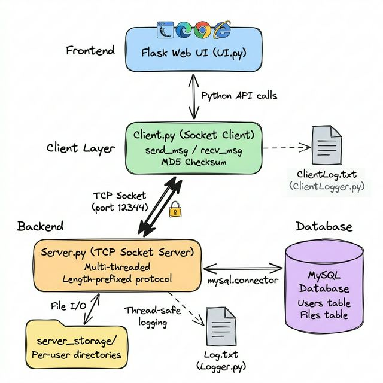
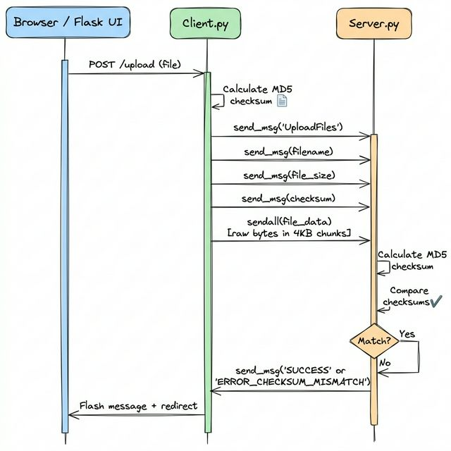
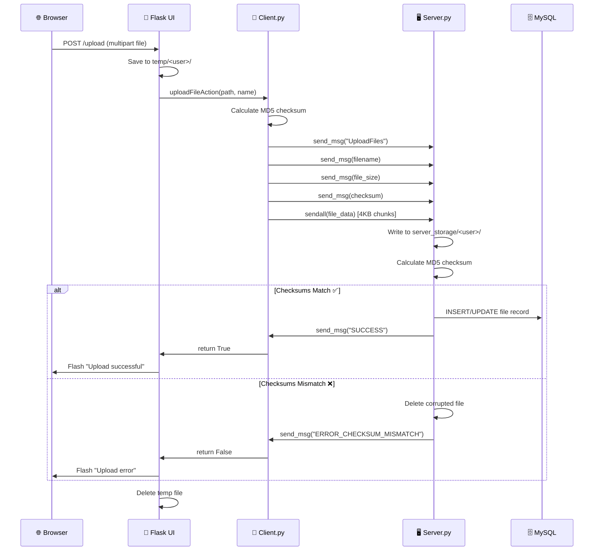
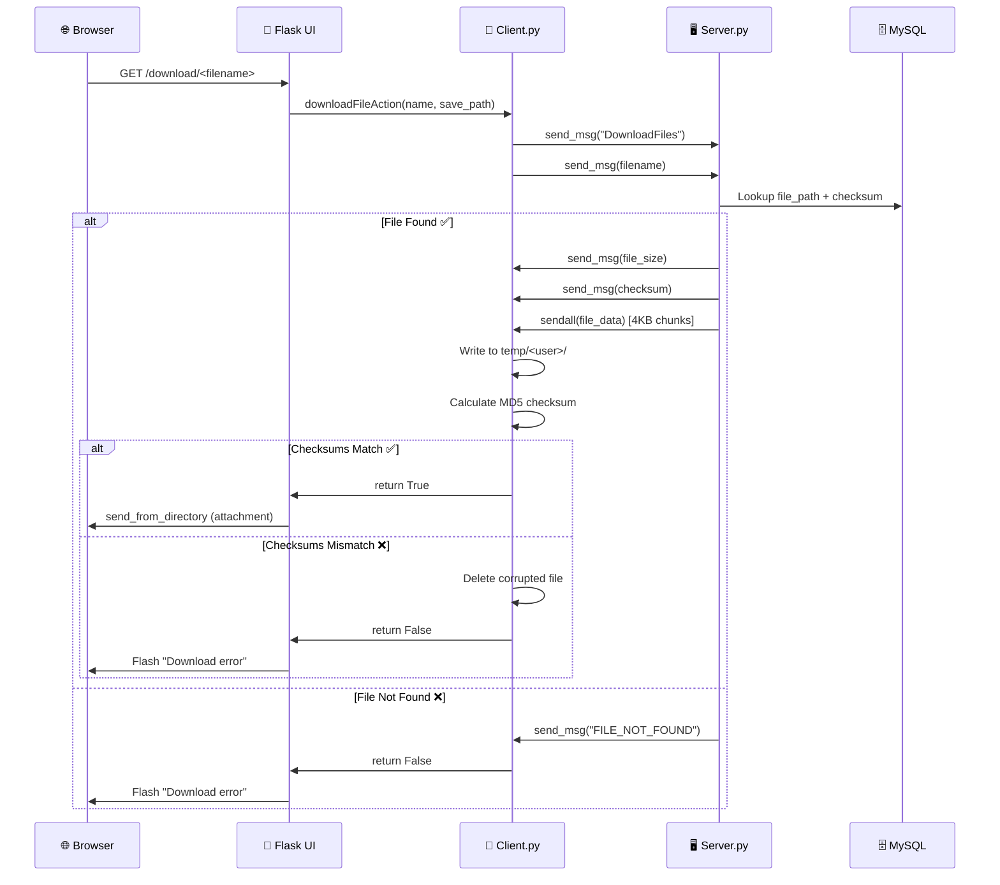
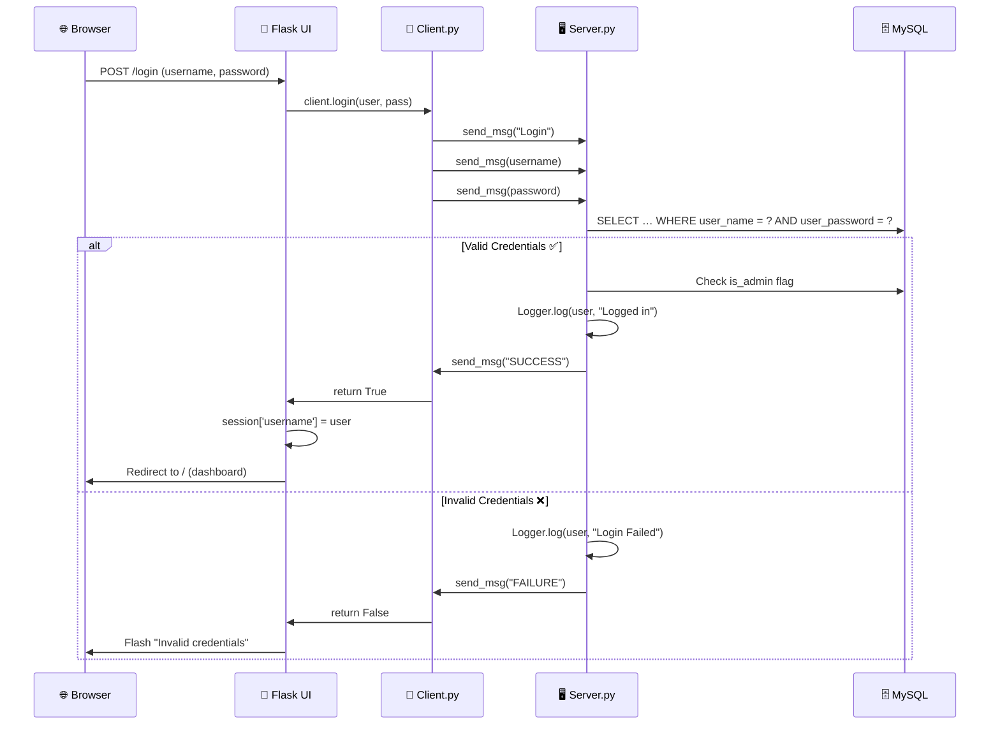
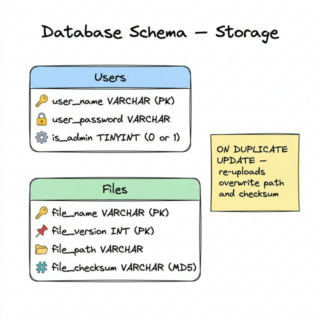

<h1 align="center">
  📁 Advanced File Sharing System
</h1>
<p align="center">
  <em>A multi-user, client–server file sharing platform built with raw TCP sockets, Flask, and MySQL.</em>
</p>
<p align="center">
  
  
  
  
  
</p>

---

## Table of Contents

- [System Architecture](#system-architecture)
- [Component Breakdown](#component-breakdown)
  - [Server (Backend)](#1--server--serverpy)
  - [Database Layer](#2--database-layer--db_handlerpy)
  - [Client Core](#3--client-core--clientclientpy)
  - [Web Interface](#4--web-interface--clientuipy)
  - [Logging](#5--logging)
- [Custom Protocol](#custom-tcp-protocol)
- [Data Flows](#data-flows)
  - [File Upload](#file-upload-flow)
  - [File Download](#file-download-flow)
  - [Authentication](#authentication-flow)
- [Database Schema](#database-schema)
- [Directory Structure](#directory-structure)
- [Security Considerations](#security-considerations)

---

## System Architecture

The system follows a **three-tier architecture**: a Flask web front-end communicates with a Python socket client, which in turn talks to a multi-threaded TCP server backed by MySQL.



```
┌─────────────────────────────────────────────────────────────────────┐
│                         USER'S BROWSER                             │
│                     (HTML/CSS + Bootstrap 5)                        │
└──────────────────────────┬──────────────────────────────────────────┘
                           │  HTTP (GET/POST)
                           ▼
┌─────────────────────────────────────────────────────────────────────┐
│                   FLASK WEB UI  (UI.py)                             │
│   Routes: /login  /logout  /upload  /download/<fn>  /delete/<fn>   │
│   Session management · Temp file handling · Flash messages          │
└──────────────────────────┬──────────────────────────────────────────┘
                           │  Python API calls
                           ▼
┌─────────────────────────────────────────────────────────────────────┐
│                 CLIENT CORE  (Client.py)                            │
│   Socket connection · Length-prefixed messaging · MD5 checksums     │
│   Client-side logging (ClientLogger.py → ClientLog.txt)            │
└──────────────────────────┬──────────────────────────────────────────┘
                           │  TCP Socket (port 12344)
                           │  Custom length-prefixed protocol
                           ▼
┌─────────────────────────────────────────────────────────────────────┐
│               TCP SOCKET SERVER  (Server.py)                        │
│   Multi-threaded · One thread per client · Daemon threads           │
│   Server-side logging (Logger.py → Log.txt)                         │
├────────────────────┬────────────────────────────────────────────────┤
│  server_storage/   │           MySQL Database                       │
│  └── <username>/   │           ├── Users table                      │
│      └── files…    │           └── Files table                      │
└────────────────────┴────────────────────────────────────────────────┘
```

---

## Component Breakdown

### 1 · Server (`Server.py`)

The heart of the system — a **multi-threaded TCP socket server** that listens on **port 12344**.

| Aspect | Detail |
|---|---|
| **Threading** | One daemon thread per client via `threading.Thread` |
| **Protocol** | Custom 4-byte length-prefixed messages (see [Protocol](#custom-tcp-protocol)) |
| **File Storage** | `server_storage/<username>/` — per-user directories |
| **Integrity** | MD5 checksum verification on every upload |
| **Supported Operations** | `Login`, `UploadFiles`, `DownloadFiles`, `ListFiles`, `DeleteFiles`, `CheckLogs`, `Disconnect` |

**Key functions:**

| Function | Purpose |
|---|---|
| `startServer()` | Binds to port, enters accept loop, spawns client threads |
| `clientHandler(sock, addr)` | Main per-client loop — dispatches commands |
| `uploadFile(…)` | Receives file + metadata, verifies checksum, stores to disk + DB |
| `downloadFile(…)` | Sends file size, checksum, then raw file bytes |
| `deleteFile(…)` | Admin-only file deletion from DB + disk |
| `listAvailableFiles(…)` | Queries DB, gets file stats from disk, sends tab-separated details |
| `login(…)` | Receives credentials, validates against DB |
| `checkLog(…)` | Admin-only: sends `Log.txt` contents |
| `getChecksum(path)` | Computes MD5 hex digest of a file |

---

### 2 · Database Layer (`db_handler.py`)

A clean abstraction over **MySQL** using `mysql.connector`. Connection parameters are read from environment variables with sensible defaults.

| Env Variable | Default | Purpose |
|---|---|---|
| `DB_HOST` | `127.0.0.1` | MySQL host |
| `DB_USER` | `DB_USER` | MySQL username |
| `DB_PASSWORD` | `DB_PASSWORD` | MySQL password |
| `DB_DATABASE` | `Storage` | Database name |

**Key functions:**

| Function | Purpose |
|---|---|
| `create_connection()` | Opens a new MySQL connection |
| `userExists(conn, user, pass)` | Validates credentials |
| `isAdmin(conn, user, pass)` | Checks admin flag |
| `userCreateAccount(…)` | Creates user with optional admin flag |
| `addfileDir(…)` | Inserts/upserts file record (`ON DUPLICATE KEY UPDATE`) |
| `getFileDir(conn, name)` | Retrieves `file_path` + `file_checksum` |
| `delFileDir(conn, name)` | Deletes a file record |
| `listAllFiles(conn)` | Returns all `(file_name, file_path)` tuples |

> **Note:** The file also creates default accounts (`admin/admin` and `na/na`) when imported directly — useful for initial setup.

---

### 3 · Client Core (`Client/Client.py`)

A **reusable `Client` class** that encapsulates all socket communication with the server.

```python
client = Client(server_ip='127.0.0.1', server_port=12344)
client.login('admin', 'admin')
client.uploadFileAction('/path/to/file.txt', 'file.txt')
files = client.listAllFiles()  # Returns [{'name': …, 'size': …, 'timestamp': …}]
client.downloadFileAction('file.txt', '/save/path/file.txt')
client.deleteFile('file.txt')
client.disconnectFromServer()
```

| Method | Returns | Purpose |
|---|---|---|
| `connectToServer()` | `bool` | Establishes TCP connection |
| `login(user, pass)` | `bool` | Authenticates with server |
| `uploadFileAction(path, name)` | `bool` | Full upload with checksum |
| `downloadFileAction(name, save)` | `bool` | Full download with checksum verification |
| `listAllFiles()` | `list[dict]` | Gets file list with size & timestamp |
| `deleteFile(name)` | `bool` | Requests admin deletion |
| `checkLogAction()` | `str` | Gets server log (admin only) |
| `disconnectFromServer()` | — | Graceful disconnect |

---

### 4 · Web Interface (`Client/UI.py`)

A **Flask** web application that wraps `Client.py` behind HTTP routes.

| Route | Method | Auth Required | Description |
|---|---|---|---|
| `/` | GET | ✅ | Dashboard — lists all files |
| `/login` | GET/POST | ❌ | Login form + authentication |
| `/logout` | GET | ✅ | Disconnect + clear session |
| `/upload` | POST | ✅ | Upload via multipart form |
| `/download/<filename>` | GET | ✅ | Download file to browser |
| `/delete/<filename>` | GET | ✅ | Delete file (admin only) |

**Templates** (Bootstrap 5):
- `base.html` — Layout with flash messages
- `login.html` — Login card
- `index.html` — File table with upload zone, download/delete actions, size formatting

---

### 5 · Logging

Both the server and client maintain **thread-safe** log files.

| Logger | File | Location | Format |
|---|---|---|---|
| `Logger.py` | `Log.txt` | Server root | `[timestamp] User:'x' Action:'y' File:'z'` |
| `ClientLogger.py` | `ClientLog.txt` | Client root | `[timestamp] User:'x' Action:'y' Details:'z'` |

Both use `threading.Lock()` to ensure safe concurrent writes.

---

## Custom TCP Protocol

All control messages between client and server use a **length-prefixed framing** protocol to avoid TCP stream boundary issues.

### Message Format

```
┌──────────────────┬────────────────────────────┐
│  4 bytes (!I)    │   N bytes (UTF-8)          │
│  Message Length  │   Message Payload          │
└──────────────────┴────────────────────────────┘
```

- **Length prefix:** 4-byte unsigned integer in **network byte order** (`struct.pack('!I', n)`)
- **Payload:** UTF-8 encoded string of exactly `N` bytes

### Helper Functions

```python
# Sending
def send_msg(sock, msg):
    msg_bytes = msg.encode('utf-8')
    sock.sendall(struct.pack('!I', len(msg_bytes)))
    sock.sendall(msg_bytes)

# Receiving
def recv_msg(sock):
    len_prefix = recv_all(sock, 4)
    msg_len = struct.unpack('!I', len_prefix)[0]
    return recv_all(sock, msg_len).decode('utf-8')

# Exact byte reader
def recv_all(sock, n):
    data = bytearray()
    while len(data) < n:
        packet = sock.recv(n - len(data))
        data.extend(packet)
    return bytes(data)
```

> **Important:** Raw file data is sent using `sendall()` in **4 KB chunks** — *not* length-prefixed — because the size is transmitted beforehand as a prefixed message.

---

## Data Flows

### File Upload Flow





---

### File Download Flow



---

### Authentication Flow



---

## Database Schema



### `Users` Table

| Column | Type | Constraint | Description |
|---|---|---|---|
| `user_name` | `VARCHAR` | **PRIMARY KEY** | Unique username |
| `user_password` | `VARCHAR` | NOT NULL | Plaintext password |
| `is_admin` | `TINYINT` | DEFAULT 0 | `1` = admin, `0` = regular user |

### `Files` Table

| Column | Type | Constraint | Description |
|---|---|---|---|
| `file_name` | `VARCHAR` | **PRIMARY KEY** (composite) | Original filename |
| `file_version` | `INT` | **PRIMARY KEY** (composite) | Version number (default: 1) |
| `file_path` | `VARCHAR` | NOT NULL | Absolute path on server disk |
| `file_checksum` | `VARCHAR` | | MD5 hex digest (32 chars) |

> Re-uploads use `ON DUPLICATE KEY UPDATE` to overwrite `file_path` and `file_checksum`.

---

## Directory Structure

```
Advanced-File-Sharing-System/
│
├── Server.py               # Multi-threaded TCP socket server
├── db_handler.py            # MySQL database abstraction layer
├── Logger.py                # Thread-safe server logging
├── Log.txt                  # Server log output
│
├── server_storage/          # Server-side file storage
│   └── <username>/          #   Per-user directories
│       └── uploaded_file.ext
│
├── Client/
│   ├── Client.py            # Socket client class
│   ├── ClientLogger.py      # Thread-safe client logging
│   ├── ClientLog.txt        # Client log output
│   ├── UI.py                # Flask web application
│   ├── temp/                # Temporary upload/download staging
│   │   └── <username>/
│   └── templates/
│       ├── base.html        # Base layout (Bootstrap 5)
│       ├── login.html       # Login page
│       └── index.html       # Dashboard (file list + upload)
│
├── docs/
│   ├── ARCHITECTURE.md      # ← You are here
│   └── images/
│       ├── system_architecture.png
│       ├── upload_flow.png
│       ├── protocol_diagram.png
│       └── database_schema.png
│
└── README.md
```

---

## Security Considerations

| Area | Current State | Recommendation |
|---|---|---|
| **Passwords** | Stored in **plaintext** in MySQL | Use `bcrypt` or `argon2` hashing |
| **Secret Key** | Hardcoded `'1234'` in Flask | Use env variable or secrets file |
| **SQL Injection** | ✅ Parameterized queries used | Already protected |
| **Path Traversal** | ✅ `os.path.basename()` / `secure_filename()` | Already protected |
| **Transport** | Raw TCP (unencrypted) | Add TLS/SSL wrapping |
| **CSRF** | No protection on forms | Add Flask-WTF CSRF tokens |
| **Session** | Flask default (client-side cookie) | Consider server-side sessions |

---

<p align="center">
  <em>Built by Enzo Lindauer, Lui-ji Daou, and Olexandr Ghanem · LAU Networks Course</em>
</p>
